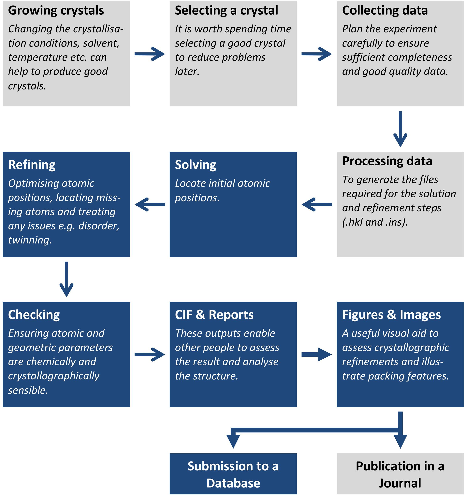

#Introduction
Olex2 is a powerful tool for small molecule crystallography and is designed to be simple to use for novice users while providing complex functionality and tools for experts. Olex2 provides features for a complete structure determination from structure solution and refinement, through report writing and CIF generation to producing images.

Olex2 supports all ShelX commands as well as having its inbuilt structure solution and refinement packages and advanced tools to assist in your work.

This manual is by no means exhaustive but aims to provide a solid overview of Olex2 and its capabilities, so that you can start tackling crystal structure solution, refinement, CIF (Crystal Information File) generation and produce images. There is often more than one way to complete a task in Olex2, but this manual focusses predominantly on the use of the GUI panel to explain the most commonly required functionality.

There are many commands in Olex2 which are accessible through the command-line. Some of these commands are very useful for crystallographic work, and these are highlighted in this text using this `CODE refine` formatting. Items you can expect to find on the GUI panel, e.g. `@Work|Toolbox-Work` are highlighted in this format. Buttons or links that do something look like this: @@Refine@@.

The manual also includes a step-by-step guide to the use of Olex2 to determine the crystal structure of sucrose.

There are frequent updates to Olex2 with new features or tools, some of which arise from specific user requests. If there is a feature or tool that is not currently available in Olex2 but you need or would like to see added, please contact the OlexSys team on *www.olex2.org*.

\vspace*{50pt}

\noindent When using Olex2 please always cite the following reference:

>OLEX2 O. V. Dolomanov, L. J. Bourhis, R. J. Gildea, J. A. K. Howard and H. Puschmann. Olex2: A complete structure solution, refinement and analysis program. (2009) *J. Appl. Cryst.*, **42**, 339-341.

\newpage
