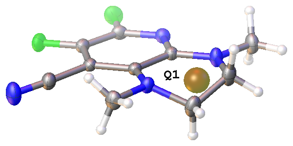
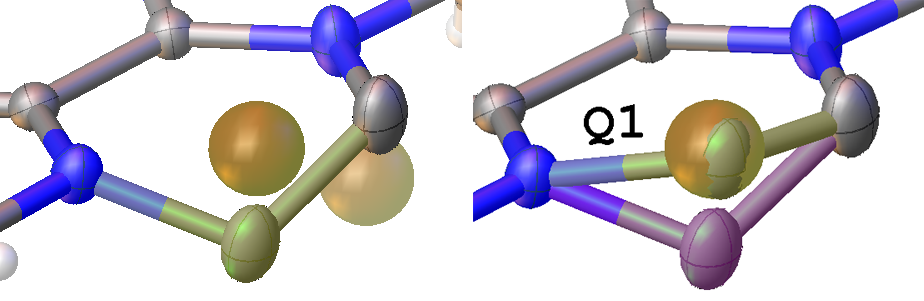
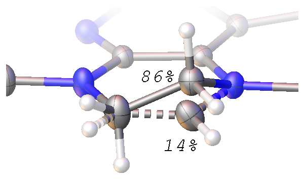

# Modelling Disorder \index{disorder}
In an ordered structure, all atoms are present in the same relative location in the asymmetric unit. In a disordered structure, some part of the structure goes 'one way' in one asymmetric unit and 'the other way' in another asymmetric unit. Since we are looking at an average of all asymmetric units, this manifests itself as iiidisorderiiiidx. When an atom always is located in the same position, then we say it is 'fully occupied', or we say it has an 'occupancy of one'. If it is in a specific location only in half of all asymmetric units, and it is in a different (close-by!) location in the other half, then we say it is 'half-occupied', or it has an occupancy of, say, 0.5 -- or 50%. There is no requirement that this disorder has to be 50/50 -- it could be any ratio. There could also be three or more different position a certain part of the structure can adopt.
If we stay with simple disorder for the moment, then it is important to realise that the two occupancies have to add up to 1 and that atoms belonging to any one part are never present in the same asymmetric unit as atoms belonging to the other part. Moreover, also: each part, when viewed together with the fully ordered atoms, must make chemical sense.
iiiDisorder modellingiiiidx involves localisation of the different components. To help with the structure visualisation (and for the automatic hydrogen atom placement to work), the connectivity table must be adjusted using the iiiPARTSiiiidx  concept, and you may have to adjust bonds manually with `CODE addbonds`, `CODE delbonds` and `CODE conn`.
Once you have identified the components and assigned them to PARTs, the relation between their occupancies has to be established. Very often the occupancy of the components has to add up to 1; but there are cases (like partial group cleavage), where this is not so and the occupancy has to be refined.
Olex2 has a set of tools to help with the disorder modelling. These are located under `@Work|Toolbox-Work` and also `@Tools|Disorder`. You will probably notice that working with disorder is significantly easier by using mostly the command line.

## Example Modelling Disorder
The easiest way to illustrate how to model disorder is to work through an example. One of the sample structures supplied, THPP, contains disorder. This example is actually more complicated than most of the cases if disorder you might come across since two different closely related components were found to have crystallised together, which is unusual.

1.    Select and open THPP. Either solve from the start or delete the disordered carbon atoms C7a and C7b - Olex2 will automatically delete associated hydrogen atoms. @@Refine@@ the structure, locate the largest Q-peak and name it a Carbon, @@refine@@ the structure anisotropically and add the hydrogen atoms. The structure should look like illustrated here. At this stage using olex2.refine you should have R1 ~0.04-0.05 (i.e. 4-5%), wR2 ~0.17-0.18 (17-18%), difference map max ~1.2 e/A, min ~-0.6 e/A with no weights applied.

    

2.    The highest peak in the difference map of ~1.2 e/A is higher than would be expected for a structure containing no particularly heavy atoms.
3.    Examine the position of the highest peaks. Q1 will appear near one of the existing carbon atoms. Measure the distance between Q1 & C6 and Q1 & N8 (`@View|Geometry|Distance and Angles (of selection) `). The distances of 1.27 and 1.49 ANGST are well in range for C-C and C-N bonds.

    >CRYST Due to lower occupancy of the disordered components, the observed distances are not exactly what would be expected for a particular bond. Refinement may be sufficient but if not, some restraints may be required later in the refinement.

4.    This all suggests that one carbon nearest Q1 should be modelled over two positions. Delete the hydrogen atoms on the two carbon atoms of the ethyl linker. There are several ways that the disorder could be modelled one of which will be run through here.
5.    Select the carbon atom to be modelled over 2 positions. Under `@Work|Toolbox-Work|Select-group-or atom(s)and-then` select @@Split@@. Holding SHIFT + the LEFT mouse button down when on the newly generated fragment (or atom in this case) which will be green, enables the fragment to be moved. Releasing the SHIFT key means that the molecule can be rotated. Adjust the position and orientation of the newly generated fragment until it approximately coincides with the relevant Q1. Press ESC to exit this mode.

    

    >OLEX2 In the case of modelling one atom it is possible to achieve steps 5 to 7 in one go by using `@Work|Toolbox-Work|Split-atoms-you-click-next-with` EADP. The method described here is applicable to modelling disordered groups of atoms which is frequently required. If treating groups of atoms and splitting them separately, make sure that all relevant atom occupancies are linked to the same free variable number (FVAR) as one cannot be present without the other.

6.    Two positions of the new carbon atom will be visible. Select the new pair of atoms. Under `@Tools|Shelx-Compatible-Constraints` select EADP from the drop down menu click @@Go@@. This will make the two atoms share the same ADP or have the same $U_{iso}$. This may not be necessary but it prevents the model from becoming unstable. In this case you can actually get away without this constraint.

    >CRYST As general rule, to apply the newly added restraints/constraint, the structure has to be refined.

7.    Olex2 will automatically have made the relevant atoms isotropic and you can now @@Refine@@. The refinement will find the occupancy of the atoms.
8.    The structure should look sensible with two positions of the additional carbon displayed. RIGHT CLICK on either of the two atoms and the refined occupancy will be displayed, Part 1 ~0.83 (83%), Part 2 ~0.17 (17%). Select both carbon atoms, `@RIGHT-CLICK|Chemical-Occupancy|Fix`, which will fix the occupancies at the refined values.
9.    RIGHT CLICK on the bond lengths and check that all of the bond lengths are chemically sensible (note the two components are different so there should be one aromatic and one ethyl C-C bond length). Click @@Refine@@.

    >CRYST If the bond lengths were not similar, restraints may be required. Under `@Tools|Shelx Compatible Restraints` select DFIX enter the distance, $d$, and a standard deviation, $s$. If a group of atoms are being modelled, restraint may be required to make pairs of equivalent bonds have similar values. Select pairs of bonds and under `@Tools|Shelx-Compatible-Restraints` select SADI, changing the s to ~0.003 so that the pairs of bond lengths are restrained to be similar within a strong weight. Click @@Go@@. Although restraining the bond lengths may not always be necessary, in reality it often is, particularly when the occupancy of the second part is relatively small. In this case EADP will be maintained but this may not always be necessary.

10.    Make the atoms anisotropic, under `@Work|Toolbox-Work` click on I_ANIS. Olex2 will automatically refine the structure.
11.    Click on `@Work|Toolbox-Work|Add-H` to add the remaining hydrogen atoms. Olex2 will only add the missing hydrogen atoms and then automatically refine the structure.

    >OLEX2 Olex2 will automatically add 3 hydrogen atoms to the non-disordered carbon to account for the fact that the other carbon atom is disordered and represents the present of two slightly different compounds. At this stage using olex2.refine you should have R1 ~0.04-0.05 (i.e. 4-5%), wR2 ~0.15-0.16 (15-16%), difference map max ~0.5 e/A min ~-0.3 e/A with no weights applied.

12.    Continue the refinement as normal. The relevant part of the final model is shown here. The 14% component is un-reacted starting material and the major part is the expected product.

    

    >CRYST This is just one approach to modelling the disorder in this structure and there are other equally valid approaches that can be used. The decision over when to split an atom is sometimes down to the crystallographers' interpretation of the data. Care should be taken not to over-model or over-restrain a structure.
