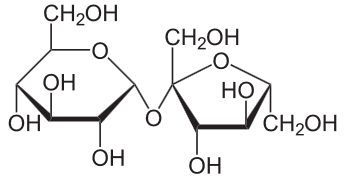

# The Aim
> Get going with Olex2 by solving your first structure!

One of the sample structures supplied with Olex2 is sucrose, so you have everything you need to get started included in the software.

