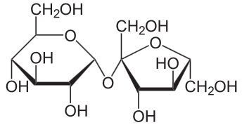

\chapter{Structure Determination of Sucrose}

This section provides a guide to the basic structure solution and refinement of sucrose. With these step-by-step instructions, you will be able to repeat this structure solution and refinement process for yourself and this will help you become familiar with the way in which Olex2 works. We will be working on this simple structure, which is supplied with Olex2.

