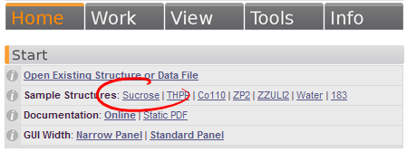

# Selecting Data

1. Click on the `@Home` tab in the GUI panel in Olex2. Under the `@Start` header one of the sample structures is **Sucrose**. Click on this and the model/instructions *.ins* file will be loaded.

>OLEX2 Since this sample structure has already been solved the sucrose molecule appears on your screen. If you are loading an unsolved structure (i.e. open the .ins file that was returned by your the data reduction software, the screen would be blank as none of the atom positions have been determined. You would, however, see some statistics of the data that are contained in the .hkl file that would have been produced by your software as well).