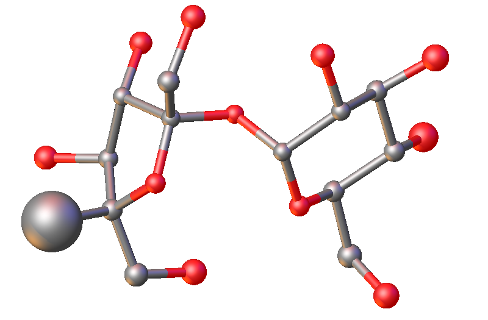
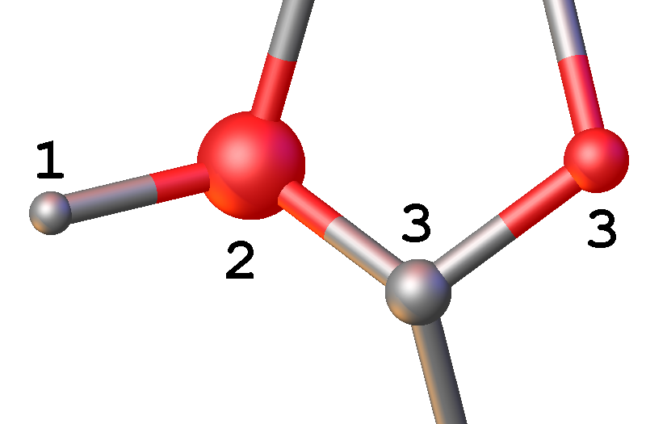
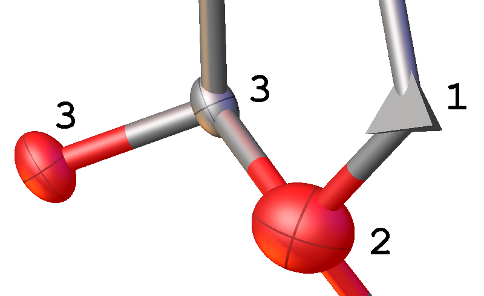
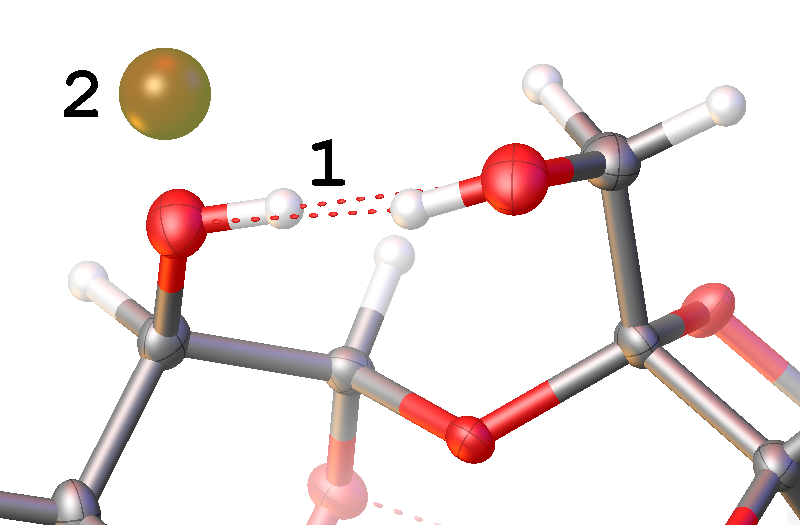

#Refinement

Now that initial atom assignments have been made; the next stage is to refine the structure to see how well your assignments fit the data and improve the model.

##Initial Atom Type Assignment

1.    Under the `@Work` tab click on the arrow next to the @@Refine@@ button so that it is pointing upwards and highlighted orange. The refinement options are now displayed.
2.    Click on the @@Refine@@ button and Olex2 starts the structure refinement. Alternatively, you can type `CODE refine` or press CTRL+R.

    >CRYST During a refinement Olex2 is calculating iiistructure factorsiiiidx based on your current structural model and comparing them to the experimentally measured values. Adjustments are then made to the atomic parameters to try and improve the fit.

3.    If one of the atoms you assigned is now represented as a comparatively huge sphere (not just slightly larger than the others), then it is not real. Select it and press the DELETE key on your keyboard (or right-click and select *Delete* from the context menu). If you delete an atom by mistake, use CTRL+Z to undo.

    

4.    If there are peaks larger than ~3 units, then there are missing C or O atoms. Select these peaks and assign them to either C or O and refine again. Repeat this step until there are no more large Q-peaks left.
5.    At this point, you can hide all remaining Q-peaks: in `@Toolbox-Work` click on the hide Q icon I_Q (or use CTRL+Q) to hide them.

6.    Rotate your structure and examine the size of the atom spheres, they should all be approximately the same size. If this is not the case, you have assigned some of the atoms incorrectly. In this image, atoms **3** are correct, with similarly sized spheres. Atom **1** is too light (it should be heavier) and atom **2** is too heavy (it should be lighter).

    

    >OLEX2 The atoms are displayed as spheres when they are modelled *isotropically* (i.e. one parameter to define the iiiatomic displacement parameteriiiidx). The size of all atom spheres is approximately the same, but there are exceptions to the rule.  For example, if there are long floppy chains (e.g. propyl or butyl) in your structure, the size of the spheres increases along the chain to the distal atom due to the increased libration. Atomic disorder can also cause changes in the visual representation of the spheres.

7.    If a sphere is significantly *smaller* than the others, the atom type is too *light* e.g. assigned as a carbon atom, but it should be an oxygen atom. If it is distinctively *larger*, it is too *heavy*. Select the offending spheres and change their atom types. If the sphere representing the atom has become too small to see, draw a rectangle (SHIFT+LEFT MOUSE) around the atom to select it.

    >CRYST If an assigned atom type is too light, there is not enough electron density available to fit the experimental data, so the refinement pulls the electron density into a smaller volume to try and improve the fit to the experimental data. If the assigned atom type is too heavy, it has more electron density than expected and the refinement increases the volume over which the electron density is spread to improve the fit to the experimental data.

8.    Carry out further refinement cycles (and adjust atom types) until all atoms are approximately represented by spheres of the same size. If the structure had become unrecognisable, you would need to click @@Solve@@ to return to the original structure and start the solving and refining processes again.

At this stage, you should have R1 ~ 8--9%. The biggest Q peak should be ~ 1.2.

## Anisotropic Refinement

1.    So far, we have limited the shape in which we can place electron density to a sphere. The next stage is to model the atoms as ellipsoids: using iiianisotropic displacement parametersiiiidx, **ADP**, \index{ADP} requires 6 parameters to define the volume occupied by the electrons during this iiianisotropic refinementiiiidx, rather than the single one that was used to set the sphere during iiiisotropic refinementiiiidx.
2.    Click on the rugby-ball shaped blue icon I_ANIS on `@Toolbox-Work` at the top right. Olex2 will then automatically carry out an *anisotropic refinement*.

    >OLEX2 Atoms are now displayed more like rugby balls. If they appear like pancakes, tetrahedra or are comparatively much larger than other atoms in the structure, you must investigate. Common reasons for odd shaped ellipsoids include incorrect atom assignments, atomic disorder, erroneous space group assignment or poor data quality.

3.    Again, the atoms should be roughly of similar size and shape in similar environments. If you have incorrect atom assignments at this stage, Olex2 might display tetrahedra instead of the expected ellipsoids. Such atoms have become iiinon-positive definiteiiiidx, **N.P.D**, \index{N.P.D} and are in reality heavier (i.e. O not C). Very large ellipsoids indicate the atom type should be lighter (i.e. C not O). In the illustration: atoms **3** are correctly assigned atom types with similar sized spheres. Atom **1** is non-positive definite (atom type is too light), and **2** is a large ellipsoid (atom type is too heavy).

    

## Add Hydrogen Atoms

1.    The next stage is to add hydrogen atoms \index{add hydrogen atoms} to your structure. In `@Toolbox-Work` click on @@Add H@@ in the top right-hand corner (or type `CODE hadd`). Olex2 automatically adds hydrogen atoms and includes them in the subsequent refinement.

    >CRYST The hydrogen atoms are automatically added using a riding model with appropriate AFIX instructions. Please refer to page \pageref{hydrogen-atoms} for more details on this.

2.    In `@Toolbox-Work`, clicking on the H square I_H cycles through *Show H* / *Show H with H-bonds* / *Hide H* (alternatively use CTRL+H). Stop at *Show H with hydrogen bonds*.

    >OLEX2 Hydrogen bonding interactions are shown as red dashed lines between a hydrogen atom and the acceptor atom.

3.    Check that there have been no extra hydrogen atoms generated. If there are any, delete them. Select atoms by clicking on them with the LEFT MOUSE button and then press the DELETE key. @@Refine@@ the structure.

    >OLEX2 If you select some hydrogen atoms and use the Delete All H button SI_KILLH or type `CODE kill $H` in the command-line, only the selected atoms will be deleted.

4.    Repeat hydrogen atom addition as before. This time Olex2 will only add the missing hydrogen atoms. If for any reason, they are still incorrect, you have to add them manually, which is what you also have to do if hydrogen atoms were missing after @@Add H@@. Refer to page \pageref{add-hydrogen-atoms} how to do this.
5.    The first assignment of hydrogen atom positions is not always fully optimised, particularly for less well-defined groups such as --OH. If there are Q-peaks close to oxygen atoms that are not where the hydrogen is, the hydrogen position may need adjusting. The image shows an incorrectly positioned hydrogen atom **1**, where the correct position is at Q-peak **2**.

    

6.    To optimise the hydrogen atom positions there are two options: multiple refinement cycles using the @@Refine@@ button may see the hydrogen atom(s) rotate onto the Q-peak (sometimes updating the weighting scheme, see below, helps the refinement escape the false minimum and to rotate the H-atom(s) into the correct position). Alternatively, select a hydrogen atom and then in `@Toolbox-Work` choose @@Fit@@ option from the @@Select group or atom(s)and then...@@ tool. Once in @@Fit@@ mode, holding the SHIFT key and LEFT MOUSE button down whilst dragging the relevant hydrogen atom allows you to move the hydrogen atom into the desired position. Press ESC when finished. Repeat if more than one atoms needs to be relocated.

    >OLEX2 When in the @@Fit@@ mode it is possible to rotate the structure to see if the relocated hydrogen atom is now on the Q-peak. Remove your finger from the mouse and SHIFT key, hold the LEFT MOUSE button down and move the mouse.

7.    @@Refine@@ the structure.

    >CRYST The refinement engine automatically adjusts the position to maintain the appropriate geometric constraints dictated by the AFIX instruction.

8.    Rotate the structure and examine the hydrogen positions to make sure that the structure looks sensible. If required, repeat adjustments to the hydrogen atom positions.
9.    Adjust the weighting scheme. Under the refinement options, there is a @@Weight@@ option. Tick the box next to @@Auto Update Weights@@. Click @@Refine@@ and repeat until the weights are no longer changing.
10.    The structure is now solved and refined.

R1 should now be between 4--5%, wR2 around 10% and the largest Q peak about 0.3.
