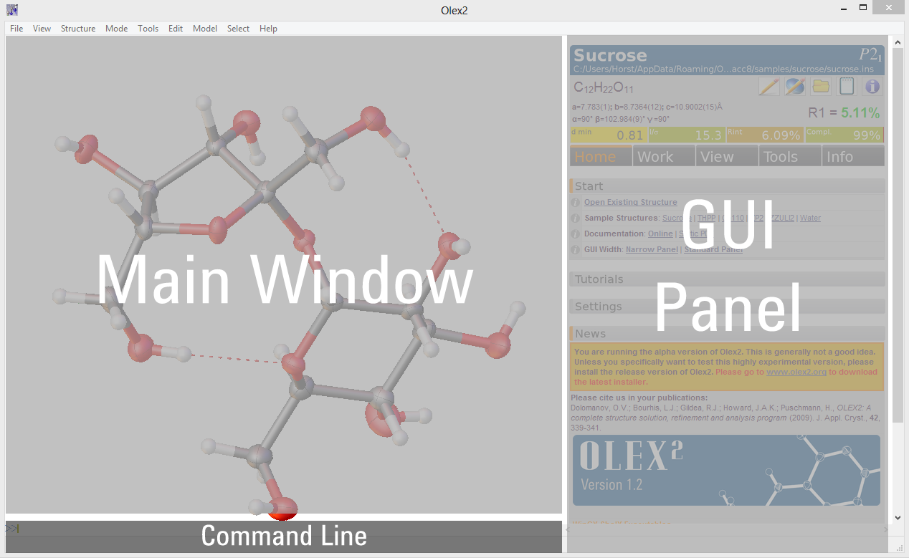

# The Olex2 GUI
> Familiarise your self with the Olex2 GUI

A screenshot of the default layout is shown below. The appearance is fully customisable (including enabling the GUI panel, graphics or text to be displayed or hidden, applying user colour schemes, changing the number of lines of text etc.), so you can set this up in a way that works best for you.

Olex2 provides the option to input information using the GUI panel, context menus and the command-line or a combination of these. The GUI panel provides access to commonly required tools and commands for structure solution and refinement. These options are also available through the command-line which provides additional functionality as well. The command-line is indicated by a >> symbol and is located at the bottom of the graphics window. The file menu, which runs along the top of the screen, is not recommended as a method for controlling Olex2.

The area on the right of the screen is referred to as the GUI panel in Olex2. It is based on a tab structure with five top level tabs available **Home, Work, View, Tools** and **Info**. The area above the tabs provides concise information about your data and structure. The coloured fields in this image summarise the quality of the diffraction data.
